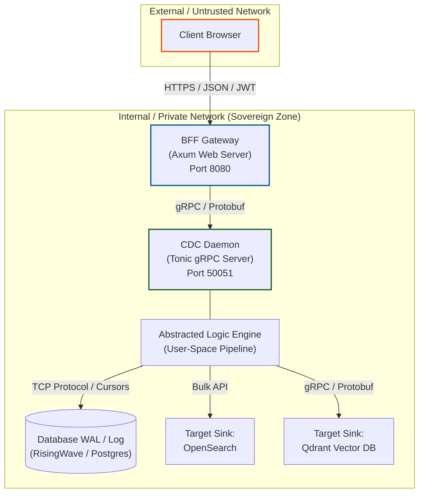
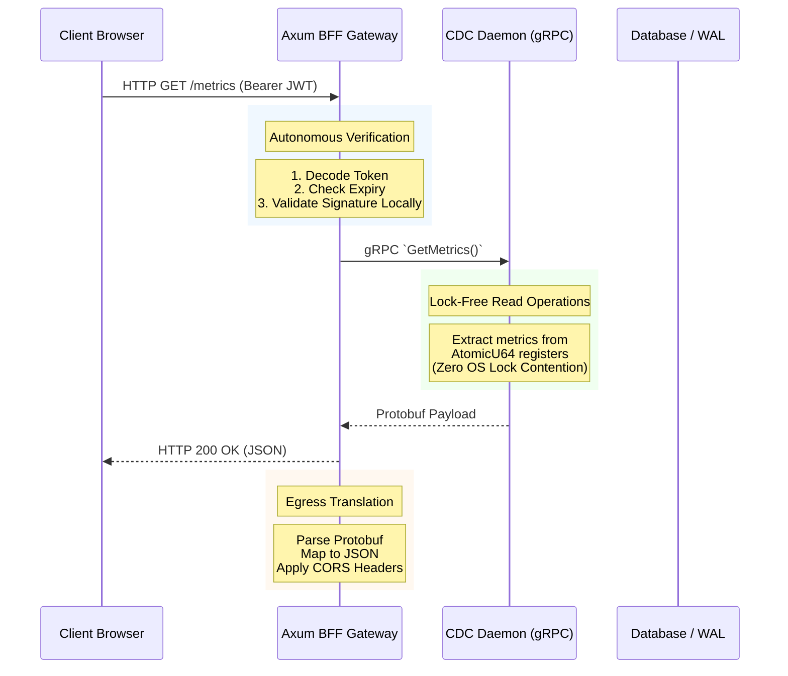

# Architectural Blueprint: Sovereign Change Data Capture (CDC) System

This document provides a deep-dive architectural blueprint and technical walkthrough of the **Sovereign Change Data Capture (CDC) system**. 

The system consists of an external **BFF Gateway** (Backend-For-Frontend) implemented in asynchronous Rust (`axum`), which communicates over a high-performance, binary `gRPC` backplane to a private **CDC Daemon** (`tonic`). The daemon supports multiple sink targets including **OpenSearch** (full-text search) and **Qdrant** (vector database), enabling flexible data routing based on pipeline configuration.

---

## 1. Core Strategic Frameworks

The entire system is engineered to support strict **Private-First / Sovereign Deployment** criteria. Three architectural principles guide every design choice in the codebase:

### A. The Sovereign Operating Model
To run reliably in completely private, air-gapped, or highly regulated cloud-sovereign regions, the system maintains **zero dependencies** on external, unvetted Software-as-a-Service (SaaS) platforms.
* **Localized Cryptography:** All authentication (token generation, signing, and verification) is localized directly within the gateway edge.
* **Perimeter Containment:** The system is fully self-contained, ensuring that telemetry, metadata, and user data never escape the private networking perimeter.

### B. Abstracted Logic Engine (ALE)
To ensure system stability, portability, and long-term maintainability across different container and cloud distributions, the core data capture and pipeline orchestration engines run **strictly in user-space**.
* **Kernel-Bound Decoupling:** The engine deliberately avoids brittle kernel-level modifications, custom system calls, or custom filesystem driver hooks.
* **Socket-Based Ingestion:** The database log stream (e.g., PostgreSQL/RisingWave Write-Ahead Logs) is ingested via standard TCP replication protocols and subscription cursors.
* **Why this matters:** Operating entirely in user-space allows the daemon to survive host OS kernel upgrades, simplifies container-native deployments (e.g., non-privileged Kubernetes pods), and prevents system-level panics from corrupting host kernels.

---

## 2. Global Architecture Map

The system separates concerns cleanly across strict network boundaries. The BFF Gateway sits at the edge, handling untrusted HTTP traffic, while the CDC Daemon resides deep within the private network.


---

## 3. High-Performance gRPC Interface

To maintain sub-millisecond coordination between the gateway and the daemon, we compile our Protocol Buffer schemas directly into native Rust structures during `cargo` compilation. This eliminates JSON serialization overhead on the internal backplane.

### Service Definition (`cdc_management.proto`)
The interface is optimized for tracking ingestion rates, dead-letter-queues (DLQ), and execution states:

```protobuf
syntax = "proto3";
package cdc_daemon;

service CdcManagement {
  rpc GetHealth (HealthRequest) returns (HealthResponse);
  rpc GetMetrics (MetricsRequest) returns (MetricsResponse);
  rpc ListPipelines (ListPipelinesRequest) returns (ListPipelinesResponse);
  rpc PausePipeline (PipelineControlRequest) returns (PipelineControlResponse);
}

message HealthRequest {}
message HealthResponse {
  bool is_healthy = 1;
  string overall_status = 2;
  map<string, string> components = 3;
}

message MetricsRequest {}
message MetricsResponse {
  uint64 records_ingested = 1;
  uint64 records_sunk_success = 2;
  uint64 records_sunk_failed = 3;
  uint64 records_dlq = 4;
  map<string, SinkMetrics> sink_metrics = 5;  // Per-sink breakdown (opensearch, qdrant)
}

message SinkMetrics {
  uint64 sunk_success = 1;
  uint64 sunk_failed = 2;
}

message ListPipelinesRequest {}
message PipelineStatus {
  string subscription_name = 1;
  string target_index = 2;
  string cursor_name = 3;
  string state = 4; // "RUNNING", "PAUSED", "ERROR"
}
message ListPipelinesResponse { repeated PipelineStatus pipelines = 1; }

message PipelineControlRequest { string subscription_name = 1; }
message PipelineControlResponse { bool success = 1; string message = 2; }
```

---

## 4. Source Code Walkthrough

### A. Code Generation Configuration (`build.rs`)
To bridge the protocol-buffer models with safe, typed Rust code, the build process compiles the protocol schemas automatically at compile time.

```rust
fn main() -> Result<(), Box<dyn std::error::Error>> {
    // Generates client/server code directly into CARGO_OUT_DIR
    tonic_build::configure()
        .build_client(true)  // Required for BFF
        .build_server(true)  // Required for Daemon
        .compile_protos(
            &["../proto/cdc_management.proto"], 
            &["../proto/"]
        )?;
    Ok(())
}
```

### B. Gateway Server Execution Core (`main.rs`)
The gateway executes an asynchronous event loop via `tokio`, initializing connection pools to the gRPC daemon and binding HTTP routes using the `axum` framework.

```rust
mod auth;
use axum::{extract::State, http::{Method, StatusCode}, middleware, routing::{get, post}, Json, Router};
use tower_http::cors::{Any, CorsLayer};
use std::sync::Arc;
use tonic::transport::Channel;

// Includes the generated tonic protobuf client natively
pub mod cdc_daemon_proto { tonic::include_proto!("cdc_daemon"); }
use cdc_daemon_proto::cdc_management_client::CdcManagementClient;

#[derive(Clone)]
struct AppState {
    grpc_client: CdcManagementClient<Channel>,
    auth_state: Arc<auth::AuthState>,
}

#[tokio::main]
async fn main() {
    // 1. Connect to the user-space CDC Daemon backplane
    let grpc_url = std::env::var("CDC_DAEMON_GRPC_URL").unwrap_or_else(|_| "http://localhost:50051".into());
    let grpc_client = CdcManagementClient::connect(grpc_url).await.expect("Failed to connect to CDC Daemon");
    
    let auth_state = Arc::new(auth::AuthState::new());
    let app_state = AppState { grpc_client, auth_state };

    // 2. Setup routes protected by cryptographic middleware
    let protected_routes = Router::new()
        .route("/api/cdc/health", get(get_health))
        .route("/api/cdc/metrics", get(get_metrics))
        .route("/api/cdc/pipelines", get(list_pipelines))
        .route_layer(middleware::from_fn_with_state(app_state.clone(), auth::require_auth));

    // 3. Public endpoints for authenticating users
    let auth_routes = Router::new()
        .route("/api/auth/login", post(auth::login_local))
        .route("/api/auth/oauth2/{provider}/login", get(auth::oauth_login))
        .route("/api/auth/oauth2/{provider}/callback", get(auth::oauth_callback));

    let cors = CorsLayer::new().allow_methods([Method::GET, Method::POST]).allow_origin(Any);

    let app = Router::new()
        .merge(protected_routes)
        .merge(auth_routes)
        .layer(cors)
        .with_state(app_state);

    let listener = tokio::net::TcpListener::bind("0.0.0.0:8080").await.unwrap();
    axum::serve(listener, app).await.unwrap();
}

// Rapid payload translation from Protobuf to JSON
async fn get_metrics(State(state): State<AppState>) -> Result<Json<cdc_daemon_proto::MetricsResponse>, StatusCode> {
    let mut client = state.grpc_client.clone();
    client.get_metrics(cdc_daemon_proto::MetricsRequest {}).await
        .map(|r| Json(r.into_inner()))
        .map_err(|_| StatusCode::INTERNAL_SERVER_ERROR)
}
```

### C. Sovereign Authentication & Middleware Engine (`auth.rs`)
The authorization subsystem processes OAuth2 flows backed by **Proof Key for Code Exchange (PKCE)**. It intercepts incoming edge traffic asynchronously to guarantee no unverified access touches the gRPC backplane.

```rust
use axum::{extract::{Query, State, Request}, http::StatusCode, response::{IntoResponse, Redirect, Response}, Json, middleware::Next};
use axum_extra::{TypedHeader, headers::{Authorization, authorization::Bearer}};
use jsonwebtoken::{encode, decode, Header, Validation, DecodingKey};
use oauth2::{basic::BasicClient, AuthUrl, AuthorizationCode, ClientId, ClientSecret, CsrfToken, PkceCodeChallenge, PkceCodeVerifier, RedirectUrl, Scope, TokenUrl};

// 1. Middleware enforcing cryptographic checks before requests are processed
pub async fn require_auth(
    State(state): State<Arc<AuthState>>,
    TypedHeader(auth): TypedHeader<Authorization<Bearer>>,
    req: Request,
    next: Next,
) -> Response {
    let token = auth.token();
    let validation = Validation::default();
    
    // Verifies signatures locally using internal symmetric keys (Sovereign Principle)
    match decode::<Claims>(token, &state.jwt_decoding_key, &validation) {
        Ok(_) => next.run(req).await, // Valid token; allow execution pipeline to proceed
        Err(_) => StatusCode::UNAUTHORIZED.into_response(), // Rejects access outright
    }
}

// 2. Receives Authentication Code, exchanges it, and signs a localized JWT
pub async fn oauth_callback(
    State(state): State<Arc<AuthState>>,
    axum::extract::Path(provider_name): axum::extract::Path<String>,
    Query(params): Query<CallbackQuery>,
) -> Result<Json<TokenResponse>, StatusCode> {
    let provider = state.oauth_providers.get(&provider_name).ok_or(StatusCode::NOT_FOUND)?;
    
    // Build the client inline (Rust type-inference handles the complex OAuth2 generics)
    let client = BasicClient::new(ClientId::new(provider.client_id.clone()))
        .set_client_secret(ClientSecret::new(provider.client_secret.clone()))
        .set_auth_uri(AuthUrl::new(provider.auth_url.clone()).unwrap())
        .set_token_uri(TokenUrl::new(provider.token_url.clone()).unwrap())
        .set_redirect_uri(RedirectUrl::new(provider.redirect_url.clone()).unwrap());

    // Acquire the stored PKCE verifier corresponding to the received callback state
    let pkce_verifier = state.pkce_verifiers.write().await.remove(&params.state)
        .ok_or(StatusCode::UNAUTHORIZED)?;

    let token_result = client.exchange_code(AuthorizationCode::new(params.code))
        .set_pkce_verifier(pkce_verifier)
        .request_async(&reqwest::Client::new()).await
        .map_err(|_| StatusCode::INTERNAL_SERVER_ERROR)?;

    // ... Fetch User Info & Generate Local JWT ...
    Ok(Json(TokenResponse { token, user: username }))
}
```

---

## 4.3 Refactoring for Reliability and Maintainability

The most recent refactor focused on turning the initial prototype into a more production-ready implementation without changing the external behavior of the CDC system. The work emphasized correctness, clarity, and safer runtime behavior across both the gateway and daemon layers.

### Key Improvements

- Typed error boundaries: The daemon and BFF now use dedicated error types and Result-based entrypoints instead of relying on panic-prone unwrap and expect paths. This makes startup failures, configuration errors, OAuth failures, and gRPC connection problems explicit and easier to diagnose.
- Explicit configuration handling: Runtime settings such as environment variables, OpenSearch connection details, and pipeline definitions are loaded through dedicated helpers, making defaults and required inputs easier to audit and less brittle during deployment.
- Smaller, focused helpers: The daemon startup path was reorganized into clearer functions for transport construction, pipeline loading, producer/consumer loop setup, and bulk submission. This reduces the amount of inline orchestration logic and makes the system easier to extend.
- Safer authentication flow: The BFF auth layer now handles OAuth provider configuration and JWT generation through explicit error propagation rather than hidden panics. This improves resilience and makes the failure modes much clearer during live operation.
- Clearer ownership and state flow: Shared runtime state is passed through explicit Arc and clone boundaries, improving maintainability and reducing accidental coupling between components.

These changes materially improve operational resilience, simplify future maintenance, and make the system better suited for long-lived sovereign deployments where startup predictability and fault clarity are essential.

### Related configuration guide

For runnable RisingWave input, use [examples/risingwave/postgres-to-opensearch.sql](examples/risingwave/postgres-to-opensearch.sql). The walkthrough should explain the design; the example file should hold the exact DDL you would apply.

For the concrete environment variables and runtime setup for the daemon and BFF, see [daemon-configuration.md](daemon-configuration.md).

### cdc-ctl operations guide

The workspace includes a control CLI named `cdc-ctl` for daemon lifecycle operations.

- Start daemon (background): `cargo run -p cdc-ctl -- start`
- Start daemon (foreground): `cargo run -p cdc-ctl -- start --foreground`
- Check daemon health and metrics: `cargo run -p cdc-ctl -- status`
  - Verbose mode (components + active pipelines): `cargo run -p cdc-ctl -- status --verbose`
  - Custom daemon URL: `cargo run -p cdc-ctl -- status --daemon-url http://remote-host:50051`
- Hot reload pipeline config: `cargo run -p cdc-ctl -- reload --daemon-url http://localhost:50051`
- Stop daemon gracefully: `cargo run -p cdc-ctl -- stop --daemon-url http://localhost:50051`
- Print effective configuration with obfuscated secrets: `cargo run -p cdc-ctl -- print-config`

### Qdrant Vector DB Sink Integration

The daemon supports Qdrant as an alternative sink target alongside OpenSearch. Qdrant integration uses native gRPC bindings via the `qdrant-client` crate, providing high-performance vector point operations.

#### Key Features:

- **gRPC Transport:** Uses `qdrant-client` (1.18.0+) with builder pattern initialization for connection pooling and timeout handling.
- **Point ID Resolution:** Automatically maps record IDs to Qdrant point IDs via UUIDv5 deterministic hashing (namespace: collection name).
- **Upsert & Delete:** Supports both vector insertion/updates (upsert) and deletion operations with configurable timeout (10s default).
- **Embedding Generation:** Optional local embedding service integration for on-the-fly vector generation via HTTP POST (5-attempt exponential backoff: 100ms → 3.2s).
- **Payload Mapping:** Converts JSON records to Qdrant Payload objects with full serde support.

#### Pipeline Configuration:

To route records to Qdrant, specify in `pipelines.yaml`:

```yaml
- subscription_name: my_qdrant_pipeline
  sink_type: qdrant
  target_collection: my_collection
  id_field: id
  vector_field: embedding  # optional; defaults to "embedding"
  batch_size: 100
```

#### Environment Variables:

- `QDRANT_URL` - gRPC endpoint URL (default: `https://localhost:6334`)
- `QDRANT_API_KEY` - optional API key for authentication

#### Per-Sink Metrics:

Qdrant performance is tracked independently via `sink_metrics.qdrant`:
- `sunk_success`: Count of successfully upserted/deleted points
- `sunk_failed`: Count of points that failed to sink (timeout or connection errors)

Monitor these alongside OpenSearch metrics to detect sink-specific failures and tune policies per sink type.

### Keycloak OIDC integration guide

The daemon remains private and non-public. Keycloak is integrated at the BFF edge so every daemon call still flows through authenticated BFF middleware.

1. Register Keycloak client for the BFF
- Realm: choose or create the target realm.
- Client protocol: OpenID Connect.
- Access type: confidential.
- Standard flow: enabled.
- Redirect URI: `http://localhost:8080/api/auth/oauth2/keycloak/callback`.

2. Configure BFF environment
- `KEYCLOAK_CLIENT_ID`
- `KEYCLOAK_CLIENT_SECRET`
- `KEYCLOAK_ISSUER` (for example `http://localhost:8081/realms/cdc`)
- `KEYCLOAK_REDIRECT_URL` (for example `http://localhost:8080/api/auth/oauth2/keycloak/callback`)

3. Wire provider in BFF bootstrap
- In `cdc-bff/src/main.rs`, register a provider named `keycloak` in the OAuth provider map.
- Resolve endpoints from issuer:
    - `${KEYCLOAK_ISSUER}/protocol/openid-connect/auth`
    - `${KEYCLOAK_ISSUER}/protocol/openid-connect/token`
    - `${KEYCLOAK_ISSUER}/protocol/openid-connect/userinfo`
- Reuse the existing PKCE flow in `cdc-bff/src/auth.rs`.

4. Login and gateway-to-daemon access path
- Browser hits `/api/auth/oauth2/keycloak/login`.
- BFF completes Keycloak code + PKCE exchange.
- BFF issues local JWT.
- All `/api/cdc/*` routes keep using `require_auth` middleware before gRPC calls to the daemon.

---

## 5. End-to-End Operational Lifecycle

Below is the execution trace for fetching ingestion data metrics through the sovereign pipeline.



### Execution Breakdown:
1. **Edge Ingress:** The client initiates an HTTP request containing a cryptographically signed Bearer JWT token.
2. **Autonomous Verification:** The gateway's Axum authentication middleware interceptor extracts and decodes the token claims directly within user-space. Signature validation requires no external, centralized calls.
3. **gRPC Delegation:** The gateway obtains a pre-established, pooled connection to the private gRPC daemon, issuing an over-the-wire binary call with minimal transport overhead.
4. **Lock-Free Read Operations:** Inside the daemon, telemetry queries read atomic `AtomicU64` registers rather than acquiring heavy operating system locks or halting internal parsing tasks. This ensures the ingestion engine continues to parse log files uninterrupted.
5. **Egress Translation:** The gateway takes the protobuf structures, maps them to JSON structures, applies proper CORS headers, and responds to the client.

---

## 6. Security & Compliance Considerations

* **Zero-Trust Edge:** The BFF Gateway assumes all incoming traffic is hostile. No request reaches the internal gRPC backplane without passing through the `require_auth` middleware.
* **PKCE Enforcement:** All OAuth2/OIDC flows utilize Proof Key for Code Exchange (PKCE) to prevent authorization code interception attacks, even if the redirect URI is compromised.
* **Memory Safety:** By leveraging Rust's ownership model and `Arc<AtomicU64>` for metrics, the system guarantees the absence of data races, buffer overflows, and null pointer dereferences, which are common vulnerabilities in C/C++ CDC agents.
* **Air-Gap Ready:** Because JWT validation, OAuth2 token exchange, and cryptographic signing are handled entirely within the local binary, the system can be deployed in completely offline, air-gapped environments without requiring external Identity Providers (IdP) network egress.

---

## 7. Enterprise Operations Baseline

This section centralizes enterprise operating controls that were previously spread across separate docs.

### 7.1 Deployment topology baseline

- Kubernetes namespace: `cdc`
- `cdc-daemon`: start at `replicas: 1` while validating source semantics
- `cdc-bff`: run at `replicas: 2` for edge resiliency
- Use readiness/liveness probes, requests/limits, and PodDisruptionBudgets
- Starter manifest: [k8s/cdc-starter.yaml](k8s/cdc-starter.yaml)

### 7.2 Identity and authorization baseline

- Keep OIDC at the BFF edge; daemon remains private
- Define and enforce at least:
    - `cdc.viewer` for read-only operations
    - `cdc.operator` for reload actions
    - `cdc.admin` for stop and privileged control actions
- All control operations should emit structured audit events with actor, action, target, result, and correlation id

### 7.3 SLO and telemetry baseline

Recommended initial SLO set:

1. control plane availability (BFF + daemon gRPC)
2. pipeline freshness (source-to-sink lag)
3. reload reliability
4. sink error rate (per-sink breakdown via sink_metrics)

Telemetry transport stays OpenTelemetry over OTLP, and metric naming remains aligned with [SPECS.md](SPECS.md).

**Per-Sink Metrics:** The daemon now tracks OpenSearch and Qdrant sink performance independently. Use these metrics to:
- Detect sink-specific failures (e.g., one sink down while the other succeeds)
- Balance load across multiple sink types
- Tune retry policies per sink (e.g., Qdrant timeout vs. OpenSearch bulk timeout)
- Alert on sink-specific degradation without impacting the overall ingestion health signal

### 7.4 Release and rollback baseline

- Build and publish immutable images (semantic version + commit SHA)
- Prefer digest-pinned deployment images in Kubernetes
- Promote the same digest across dev, staging, and prod
- Roll back by redeploying last known-good digest
- Image policy details live in [SPECS.md](SPECS.md)

### 7.5 Canonical documentation map

This repository now uses three primary operational docs:

1. [architecture_walkthrough.md](architecture_walkthrough.md) for architecture and enterprise controls
2. [daemon-configuration.md](daemon-configuration.md) for runtime config, day-2 operations, and troubleshooting
3. [image_generation_guide.md](image_generation_guide.md) for image build and delivery workflows

